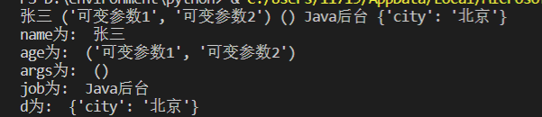
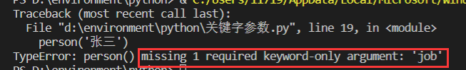
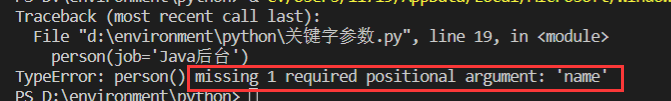
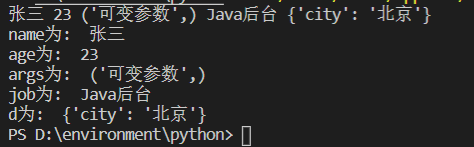

#### 定义函数

```python
def my_abs(x):
    if x >= 0:
        return x
    else:
        return -x
```

#### 默认参数

函数的默认参数的地址是不会改变的

**默认参数必须指向不变对象**

```python
def power(x, n=2):
    pass
```

#### 可变参数

可变参数允许方法接收多个参数，可变参数在函数内部是一个`tuple`元组

```python
def calc(*number):
    pass

# 把 list 当可变参数传入方法
num = [1,2,3]
calc(*num)
```

#### 关键字参数

允许方法接收0个或任意个含参数名的参数，关键字参数在方法内部是一个`dict`字典（map）

```python
# 定义一个含有关键字参数的方法
def person(name, age, **kw):
    print('name: ', name, 'age: ', age, 'other: ', kw)
# 调用 key = value  key不需要引号修饰
person('张三', 19, 城市='北京')

d = {'city':'北京', 'job':'Java后台工程师'}
# 将一个 dict 当做关键字参数传入
# 作为关键字参数的 dict 的关键字只能是 string 类型
person('张三', 20, **d)
```

限制关键字的关键字参数

关键字参数必须带上`key`，和位置参数不一样。**可变参数后**面的参数都是**关键字参数**

```python
def person(name, age, *, city, job):
    pass
# 调用 person 函数
person('张三', 23, city='北京', job='Java后台工程师')

# 如果中间有个可变参数，那么后续的关键字参数不需要 * 隔开
def person(name, age, *args, job, city):
    print(name, age, job, city, args)
person('张三', 23, '元组1', '元组2', city='北京', job='Java后台工程师')

# 关键字参数也能有默认值
def person(name, age, *, city='北京', job='Java后台工程师')
```

#### 参数总结

> - 函数的参数有：必选参数、默认参数、可变参数（*args）、关键字参数（**args）、命名关键字（, \*，city）参数五种参数
> - 参数定义的顺序必须为：必选参数、默认参数、可变参数、命名关键字参数、关键字参数

***

##### **参数输入的优先级为：优先选择必选参数、默认参数**

```python
def person(name, age = 23, *args, job, **d):
    print(name, age, args, job, d)
    print('name为: ',name)
    print('age为: ', age)
    print('args为: ',args)
    print('job为: ', job)
    print('d为: ', d)
person('张三', ('可变参数1', '可变参数2'), job='Java后台', city='北京')
```



> 此处的`默认参数`job虽然有默认值，但依旧优先为其赋值，即使是参数类型不一致
>
> 可变参数的优先级很低

***

##### 必选参数和命名关键字参数不能缺失

```python
def person(name, age = 23, *args, job, **d):
    print(name, age, args, job, d)
    print('name为: ',name)
    print('age为: ', age)
    print('args为: ',args)
    print('job为: ', job)
    print('d为: ', d)
person('张三')
person(job='Java后台')
```





> - 必选参数、命名关键字参数不能缺失
> - 可选参数（*args）、关键字参数（**d）可以缺失

***

##### 参数若是 *args 或 **args的形式，会将集合拆开依次填充

```python
def person(name, age = 23, *args, job, **d):
    print(name, age, args, job, d)
    print('name为: ',name)
    print('age为: ', age)
    print('args为: ',args)
    print('job为: ', job)
    print('d为: ', d)
args = ('张三', 23, '可变参数')
person(*args, job='Java后台', city='北京')
```



> - 若函数的参数没有定义`可变参数`和`关键字参数`那么*args 和 **args 元素个数要和参数的个数严格相等
> - 特殊情况：*args 的字符串会被当成字符数组

***