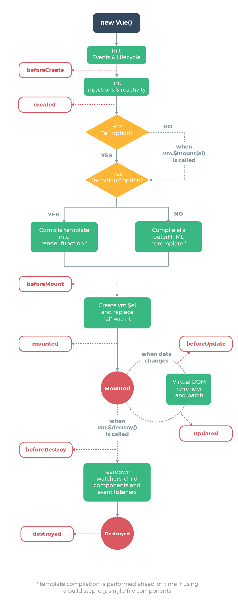
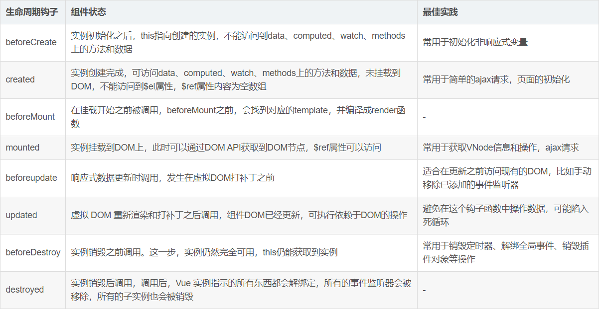

# 1.HTML
```html
<!--label标签的使用
    必选属性for,值为需要绑定的标签的id
-->
<input type="checkbox" id="runoob">
<label for="runoob">Runoob</label>
```

# 2.css
```css
1.font-szie: 0px: 用于消除子元素的间隙
```

# 3.vue
## vue网络编程部分
 ```html
<!--    引入axios的代码-->
<script src="https://unpkg.com/axios/dist/axios.min.js"></script>
 ```
* vue的生命周期


beforeCreate
> 在实例初始化之后，数据观测(data observe)和event/watcher配置之前调用
>
> **此时`data`和`methods`里面的内容还未被初始化**

created
> 实例已经创建完成后被调用。在这一步，实例已完成一下配置：数据观测(data observe)，
> 属性和方法的运算，watcher/event事件的回调。但是挂载阶段还没开始，$el属性目前不可见
>
> **此时`data`和`methods`里面的内容已经被初始化**

beforeMount
> 在挂载开始前被调用：相关的render函数被调用
>
> **此时页面中的元素还没有被替换依旧显示`{{ msg }}`，此时的模板还未被挂载只在内存中渲染**

Mounted
> el被新创建的vm.$el替代，并挂载到实例上去之后调用该钩子
>
> **此时页面中的元素已经被替换显示出真实想要的数据，Mounted是实例创建过程中的最后一个钩子函数**

beforeUpdate
> 数据更新前调用，发生在虚拟Dom重新渲染和打补丁之前。你可以在这个钩子中进一步的更改状态，这不会触发附件的重渲染效果
>
> **此时`data`里面的数据更新了，但还未渲染到`页面`上，所以页面数据和data数据不一致**

updated
> 由于数据更改导致的虚拟DOM重新渲染和打补丁，在这之后会调用此钩子函数
>> 当这个钩子被调用时，组件DOM已经更新，所以现在可以执行依赖于新的DOM的操作。然而大多数情况下，应该避免在此期间更改状态
因为可能导致更新无限循环。

beforeDestroy
> 实例销毁之前调用。在这一步，实例仍然完全可以调用

destroyed
> Vue实例销毁后调用。调用后，Vue实例指示的所有东西都会解绑，所有的事件监听器都会被移除，所有的子实例也会销毁。改钩子在服务器渲染期间不被调用


* v-show和v-if控制的标签的显示与否，而v-bind:class则是控制标签的class属性
* v-bind和v-model很像，但v-model只在表单元素内使用，在表单元素外使用无效，v-model是双向绑定的；v-bind可以绑定参数或者样式，但不是双向绑定。
在自定义组件中可用于绑定参数

# 4.v-model 和 v-bind 的区别

# 5.Prop

> 在自定义组件里面自定义一个 attribute，用于父组件向子组件传递参数

```js
// 自定义一个主键
Vue.component('blog-post', {
  props: ['title'],	// 在这个组件里面自定义一个名为 title 的属性
  template: '<h3>{{ title }}</h3>'
})

// 这是设置了 title 的值
<blog-post title="My journey with Vue"></blog-post>
<blog-post title="Blogging with Vue"></blog-post>
<blog-post title="Why Vue is so fun"></blog-post>
```

# 6.表单

> - `label-position` 控制 tag 的位置，此便签必须和 `label-width` 一起使用`label-width`支持 auto 属性
> - `el-form-item` 中的 `prop` 属性的内容是进行表单验证的字段
> - `el-form`（最外面那层）绑定的`model`是一个表单对象，`el-input` 里面才绑定该对象的具体值
> - `prefix-icon`用于设置表框里面的icon
> - `el-button`中的`type`用于设置按钮的样式
> - `el-form`中的`rules`用于设置表单验证规则

```vue
<template>
  <div class="main-container">
    <el-form :model="resultForm" :label-position="top" :rules="rules" label-width="auto" class="my-form">
      <el-form-item label="账号" prop="name">
        <el-input type="text" v-model="resultForm.name" prefix-icon="el-icon-user" placeholder="请输入用户名..." autocomplete="off"></el-input>
      </el-form-item>

      <el-form-item label="密码" prop="password">
        <el-input type="password" v-model="resultForm.password" prefix-icon="el-icon-lock" placeholder="请输入密码..." autocomplete="off"></el-input>
      </el-form-item>

      <el-form-item>
        <el-button type="primary">登录</el-button>
        <el-button style="float: right">重置</el-button>
      </el-form-item>
    </el-form>
  </div>
</template>

<script>
export default {
  name: "login",
  data(){
    return {
      resultForm:{
        name: '',
        password: ''
      },
      rules:{
        name:[ //是一个数组
            //第一个规则
          { //具体的规则是一个对象类型
            required: true,
            message: '请输入账户',
            trigger: 'blur'
          }
        ],
        password:[
          {
            require: true,
            message: '请输入密码',
            trigger: 'blur'
          }
        ]
      }
    }
  }
}
</script>

<style scoped>
.main-container{
  margin: auto;
}

.my-form{
  max-width: 400px;
  margin: auto;
  padding-bottom: 15em;
  padding-top: 5.5em;
}
</style>
```

## 自定义表单验证规则

```vue
<script>
export default {
  name: 'test',
  data() {
    var checkAge = (rule, value, callback) => {
      if (!value) {
        return callback(new Error('年龄不能为空'));
      }
      setTimeout(() => {
        if (!Number.isInteger(value)) {
          callback(new Error('请输入数字值'));
        } else {
          if (value < 18) {
            callback(new Error('必须年满18岁'));
          } else {
            callback();
          }
        }
      }, 1000);
    };
    var validatePass = (rule, value, callback) => {
      if (value === '') {
        callback(new Error('请输入密码'));
      } else {
        if (this.ruleForm.checkPass !== '') {
          this.$refs.ruleForm.validateField('checkPass');
        }
        callback();
      }
    };
    var validatePass2 = (rule, value, callback) => {
      if (value === '') {
        callback(new Error('请再次输入密码'));
      } else if (value !== this.ruleForm.pass) {
        callback(new Error('两次输入密码不一致!'));
      } else {
        callback();
      }
    };
    return {
      ruleForm: {
        pass: '',
        checkPass: '',
        age: ''
      },
      rules: {
        pass: [
          {validator: validatePass, trigger: 'blur'}
        ],
        checkPass: [
          {validator: validatePass2, trigger: 'blur'}
        ],
        age: [
          {validator: checkAge, trigger: 'blur'}
        ]
      }
    };
  },
  methods: {
	//略
  }
}
</script>
```

# 7. 选择器

> - `label` 是选择器要显示的内容
> - `value`是选择的要提交的属性
> - 一般情况`id`和`value`是相同的
> - 如果要想传递对象，那么需要设置`value-key`属性。对应的是对象的唯一字段（id）


```vue
<el-col :span="6" style="margin-left: 0.5em;margin-right: 2.5em">
    <el-select name="type" v-model="type" filterable clearable>
        <el-option
                   v-for="type in types"
                   :key="type.id"
                   :label="type.value"
                   :value="type.id"
                   ></el-option>
    </el-select>
</el-col>
```

# 8. 表格

> - 表头错位解决方式

```css
/* 在 app.vue 或者 index.vue 中导入 */
body .el-table th.gutter{
  display: table-cell!important;
}
```

> - 对表格中的数据进行操作

```vue
<!-- 需要引入一个 Template模板插槽-->
<!-- scope.row便是该行的对象-->
<template slot-scope="scope">
	<el-popover trigger="hover" placement="top">
        <p>姓名: {{ scope.row.name }}</p>
        <p>住址: {{ scope.row.address }}</p>
        <div slot="reference" class="name-wrapper">
            <el-tag size="medium">{{ scope.row.name }}</el-tag>
        </div>
    </el-popover>
</template>

<!-- scope.$index是表格中的行数-->
<el-table-column label="操作">
    <template slot-scope="scope">
		<el-button
           size="mini"
           @click="handleEdit(scope.$index, scope.row)">编辑</el-button>
		<el-button
           size="mini"
           type="danger"
           @click="handleDelete(scope.$index, scope.row)">删除</el-button>
    </template>
</el-table-column>
```

# 9. axios

1. 安装axios

```bash
npm install vue-axios --save
npm install qs
```

2. 全局注册（在main.js中注册）

```js
import Vue from 'vue'
import axios from 'axios'
Vue.prototype.$axios = axios    //全局注册，使用方法为:this.$axios
Vue.prototype.$qs = qs   //全局注册qs, 用于格式化数据
```

3. 使用

```js
submit(){
    this.$axios.post(this.$store.state.httpUrl + ":9000/generator",this.$qs.stringify(this.form))
        .then(function (response) {
        console.log(response)
    })
        .catch(function (error) {
        alert("发生错误")
        console.log(error)
    })
}
```

# 10. 路由传参

> 通过 props 方式进行路由传参

```js
const User = {
  props: ['id'],  /* props 声明一个属性用于接收参数, 传过来的参数直接赋值给 id 可用过{{id}} 或者 {{this.id}} 直接调					用*/
  template: '<div>User {{ id }}</div>'
}
const router = new VueRouter({
  routes: [
    { path: '/user/:id', component: User, props: true },  /* props属性设置为true */

    // 对于包含命名视图的路由，你必须分别为每个命名视图添加 `props` 选项：
    {
      path: '/user/:id',
      components: { default: User, sidebar: Sidebar },
      props: { default: true, sidebar: false }
    }
  ]
})
```

> router-link to 动态赋值

```html
<router-link :to="{path: '/blog/' + blog.id}"> <!-- blog.id为一个值-->
```

# 11. 监听器

## 1.简单监听功能

```html
<div id="demo">{{ fullName }}</div>
```

```js
var vm = new Vue({
  el: '#demo',
  data: {
    firstName: 'Foo',
    lastName: 'Bar',
    fullName: 'Foo Bar'
  },
  watch: {
    firstName: function (val) { // 只有一个参数的时候，接收的是newVal；如果是两个参数的时候 newVal, oldVal
      this.fullName = val + ' ' + this.lastName
    },
    lastName: function (val) {
      this.fullName = this.firstName + ' ' + val
    }
  }
})
```

## 2.监听器里面需要执行其他方法以及设置监听器的配置

```js
 watch: {
    title:{
      handler(){
        this.getData()  // 需要执行的方法
      },
      immediate: true   // 设置 "首次调用也执行" 的属性
    }
  }
```

## 3.监听路由变化

```js
watch: {
    $route: {  // 本对象的 路由对象
      handler(newRoute) { // 新的路由对象 执行器里面可以接受对象
        this.activeIndex = newRoute.path;
      },
      //首次调用也监视 Route
      immediate: true
    }
  }
```

