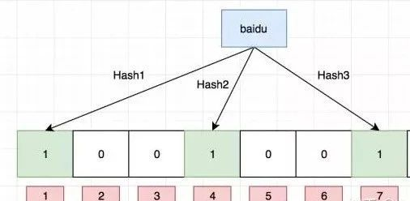
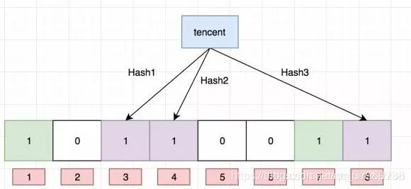
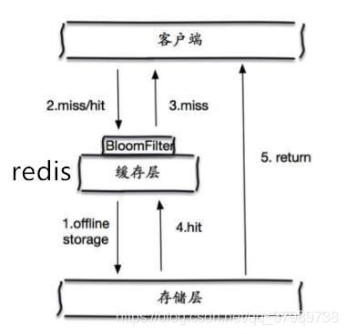
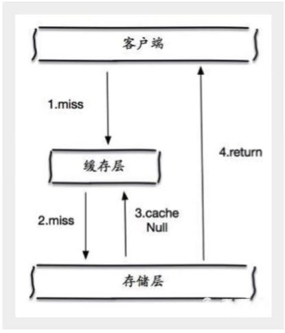
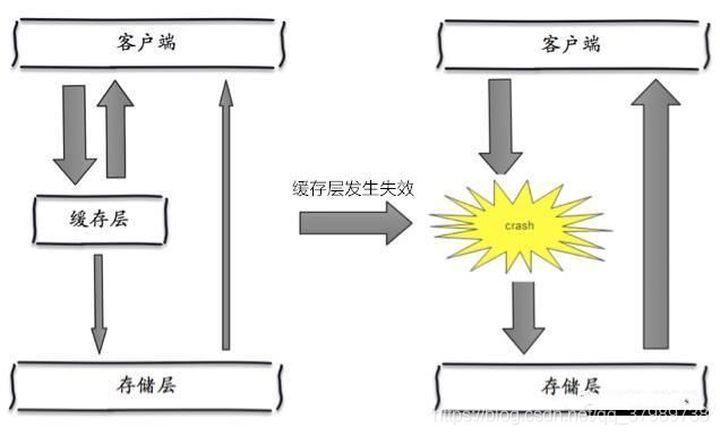
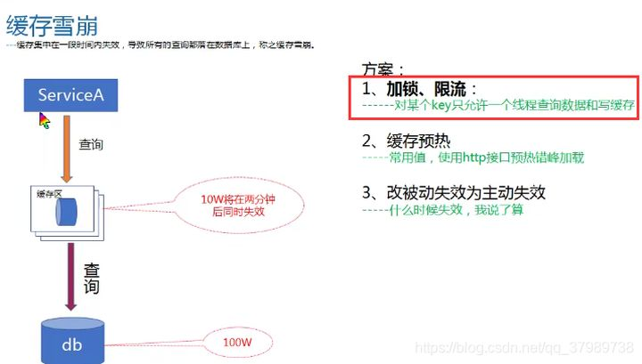

### docker 安装docker

```bash
# 拉取镜像
docker pull redis
# 编辑docker-compose.yml文件
version: '3'

services:
   redis:
      image: redis
      restart: always
      container_name: myredis
      ports: 
        - 6379:6379
      volumes: 
        - /usr/local/docker/redis/redis.conf:/usr/local/etc/redis/redis.conf:rw  # 挂载配置文件
        - /usr/local/docker/redis/data:/data:rw  # 数据持久化
      command: 
        /bin/bash -c "redis-server /usr/local/etc/redis/redis.conf" # 指定运行时使用的配置文件
 
# 需要去redis下载配置文件redis.conf然后上传
# 将 daemonize 属性改为yes 如果是使用docker安装，则无视这一部分
daemonize yes
```

### 常用指令

```bash
# 运行服务器
redis-server -p 6379

# 运行客户端
redis-cli -p 6379

# 清除当前数据库
flushdb

# 清除所有数据库
flushall 

# 查看所有key
keys *

# 查看key是否存在
exists [key的值] # 返回1存在 返回0不存在

# 移动key
move [key的值] [目录数据库] # move test 1 将test移动到1数据库

# 设置key过期时间
expire [key的值] [过期时间单位为秒]

# 查看当前key的剩余时间
ttl [key的值]

# 查看key的类型
type [key的值]

# 删除某个key
del [key的值]

# 从新命名某个key
rename [oldKey] [newKey]

# 向key追加内容；如果key不存在就相当于新建key
append [key的值] [需要追加的内容]

# 获取key的长度
strlen [key的值]

# key的值自增
incr [key的值]

# key增加指定数
incrby [key的值] [指定的值]

# key的值自减
decr [key的值]

# 减少指定数
decrby [key的值] [指定的值]

# 截取字符串
getrande [key的值] [开始的下标] [结束的下标] # 0 -1 表示截取全部字符串

# 替代字符串
setrange [key的值] [开始的下标] [需要替换的字符串] # 字符串一对一替换

# 设置过期时间
setex [key的值] [过期时间] [字符串的值]

# key不存在就设置（分布式锁中常常使用）
setnx [key的值] [字符串] # 普通的set会覆盖value

# 批量设置值
mset [key value...]

# 批量获取值
mget [key...]

# setnx的批量设置版
msetnx [key value...] # 若其中的一个key存在，那么所有的key都会设置失败（事务的原子性）

# 设置对象（json格式）
set [key的值] {name:zhangsan,age:12}

# 设置对象的进阶方式 对象名:{id}:{filed}
127.0.0.1:6379> mset user:1:name lisi user:1:age 23
127.0.0.1:6379> keys *
1) "user:1:name"
6) "user:1:age"
127.0.0.1:6379> mget user:1:name user:1:age
1) "lisi"
2) "23"

# 先get再set
getset [key] [value] # 获取的是set之前的值，如果不存在则返回nil（空）

```

### 解决Linux服务器重启Redis数据部分丢失问题

```bash
vim /etc/sysctl.conf
# 在最后一行添加
vm.overcommit_memory = 1
# 使配置生效
sysctl -p
```

### 五大数据类型

> Redis 是一个开源（BSD许可）的，内存中的数据结构存储系统，它可以用作**数据库**、**缓存**和**消息中间件MQ。** 它支持多种类型的数据结构，如字符串（strings）， 散列（hashes）， 列表（lists）， 集合（sets）， 有序集合（sorted sets） 与范围查询， bitmaps， hyperloglogs 和 地理空间（geospatial） 索引半径查询。 Redis 内置了 复制（replication），LUA脚本（Lua scripting）， LRU驱动事件（LRU eviction），事务（transactions） 和不同级别的 磁盘持久化（persistence）， 并通过 Redis哨兵（Sentinel）和自动 分区（Cluster）提供高可用性（high availability）。

#### String

> 操作指令子在`常用指令`那。
>
> String的使用场景：value除了是我们的字符串还可以是我们的数字
>
> - 计数器
> - 统计多单位的数量
> - 粉丝数
> - 对象缓存存储

#### List

**（链表）（list的值可以重复）**

> - 消息队列

```bash
# 从头部放入数据
lpush [key] [value...] # 从头部放入（相当出栈）

# 从尾部放入数据
rpush [key] [value...]

127.0.0.1:6379> rpush list right
(integer) 6
127.0.0.1:6379> lrange list 0 -1
1) "5"
2) "4"
3) "3"
4) "2"
5) "1"
6) "right"

# 取出数据
lrange [key] [start] [stop] # 先进后出（栈）

# 头出栈
lpop [key] [count]

# 尾出栈
rpop [key] [count]

# 获取某一个值 
lindex [key] [index] # index -1 是最后的一个元素

# 获取list的长度
llen [key]

# 准确移除某一个值
lrem [key] [count] [value] # count > 0从前往后移除；count = 0移除全部；count < 0从后往前移除

# 截取list
ltrim [key] [start] [stop]

# 弹出栈底元素然后加入新栈
rpoplpush [key1] [key2]

# 在key中指定下标设置value 
lset [key] [index] [value] # 其中index不能超出已有的下标范围

# 在key的某几个元素中间插入
linsert [key] [before|after] [被插入的value] [需要插入的value] # 如果有两个相同的value则优先靠近头部的；如果key不存在则什么都不会发生
```

#### Set

**无需不重复集合**

> - 好友列表
> - 关注列表

```bash
# 添加值
sadd [key] [value...] # 添加失败时返回0，添加重复数据时会失败

# 查看值成员
smembers [key]

# 查看是否存在成员
sismember [value] [value] # 存在返回1，不存在返回0

# 查看成员的个数
scard [key]

# 移除某个成员
srem [key] [value]

# 随机获取n个成员
srandmember [key] [count]

# 随机弹出n个成员
spop [key] [count]

# 移动一个指定的成员到另一个set集合中
smove [原key] [目标key] [value] # 如果目标key不存在，则创建一个新的key

# 差集
sdiff [key1] [key2] # key1 和 key2 的差集

# 交集
sinter [key1] [key2]

# 并集
sunion [key1] [key2]
```

#### Hash

>key-map（<key,value>）
>
>- 用户信息
>- 经常变动的信息
>- 比String类型更适合存储对象

```bash
# 设置Hash
hset [key] [field] [value] # 如果filed存在，则会进行覆盖但返回值是0

# 取出Hash
hget [key] [field] [value]

# 批量设置Hash
hmset [key] [field] [value]... # 如果filed存在，则会进行覆盖

# 批量获取Hash
hmget [key] [field...]

# 获取所有Hash
hgetall [key] # field 和 value一起获取

# 删除N个Hash
hdel [key] [field...]

# 获取Hash的长度（一共有多少个键值对）
hlen [key]

# 判断某个field是否存在
hexists [key] [field]

# 获取所有的key
hkeys [key]

# 获取所有的value
hvals [key]

# 指定某个field的值增加
hincrby [key] [field] [increment] # 似乎某有hdecrby

# 如果不存在则设置，如果存在则跳过
hsetnx [key] [field] [value]
```

#### Zset

> **有序集合**，新增了个version字段用于判断优先级。

```bash
# 新增Zset
zadd [key] [优先级] [value]... # 如果优先级一样，也不会覆盖；不允许优先级不相同value相同的情况出现；可以同时添加多个值

# 批量获取Zset
zrange [key] [start] [stop] # 本身就是从小到大排序获取

# 批量获取Zset2
zrevrange [key] [start] [stop] # 从大到小排序获取
### 对数量进行限定

# 从小到大排序获取
zrangebyscore [key] [min] [max] [withscores] # 相对比zrange，这个可以带上scores

# 从大到小排序获取
zrevrangebyscore [key] [max] [min] [withscores] # 相对比zrange，这个可以带上scores
### 对值的范围进行限定

# 删除N个value
zrem [key] [value...]

# 获取Zset中集合的个数
zcard [key]

# 获取区间元素的个数
zcount [key] [min] [max]
```

### 三种特殊类型

#### geospatial（地理空间）

> **可以使用Zset指令操作geo**
>
> 地理位置，经纬度

```bash
# 规则；两级是无法添加；一般会下载城市数据然后使用Java程序一次性导入
# 添加成员
geoadd [key] [经度] [维度] [member（城市名|人名）]...

# 获取成员的经纬度
geopop [key] [member...]

# 返回两个位置的距离
# 指定单位的参数 unit 必须是以下单位的其中一个：
m 表示单位为米。
km 表示单位为千米。
mi 表示单位为英里。
ft 表示单位为英尺。
geodist [key] [member1] [member2]

# 根据经纬度和半径查询范围内的成员个数
georadius [key] [经度] [维度] [半径] [单位]  # 返回的是member的值
# withdist：附带距离   withcoord：附带经纬度 count [value]：限定返回的个数

# 根据member和半径查询范围内成员的个数，返回值包括圆心
georadiusbymember [key] [member] [半径] # 后续参数和georadius一样
```

#### hyperloglogs

> 占用的内存是固定的
>
> 用于统计基数，但有0.81%的错误率；用于统计UV

```bash
# 添加value
pfadd [key] [value...] # 不能添加重复的，如果添加多个的时候有一个是重复的，那么重复的不会添加不重复的会添加

# 统计N个集合的并集的基数
pfcount [key...]

# 统计N个key的并集的技术
pfmerge [生成的key] [需要合并的素材] [需要合并的素材]
```

#### Bitmap

> 位存储（0,1存储），操作二进制位进行记录

```bash
# 设置bitmaps
setbit [key] [index] [0|1]

# 获取某一个index的bit
getbit [key] [index]

# 统计bit为1的个数
bitcount [key] [start end]
```

### 事务

>- redis的单条命名是保证原子性的，但redis的事务是**不保证原子性的**
>- redis事务**没有隔离性**
>- redis事务
>  - 开启事务（multi）
>  - 命令入队
>  - 执行事务（exec）

```bash
127.0.0.1:6379> multi # 开启事务
OK
# 事务入队
127.0.0.1:6379(TX)> set key1 value1
QUEUED
127.0.0.1:6379(TX)> set key2 value2
QUEUED
127.0.0.1:6379(TX)> get key1
QUEUED
127.0.0.1:6379(TX)> set key3 value3
QUEUED
127.0.0.1:6379(TX)> EXEC # 执行事务
1) OK
2) OK
3) "value1"
4) OK

127.0.0.1:6379> multi # 开启事务
OK
# 事务入队
127.0.0.1:6379(TX)> set key4 value4
QUEUED
127.0.0.1:6379(TX)> DISCARD # 结束事务，整个事务的内容都没有执行
OK

# 编译型异常事务不会执行
# 运行时异常，除了有异常的语句其他都会执行
```

### 乐观锁

> 使用 **watch**字段即可

### jedis

> java官方推荐redis中间件

**导入依赖**

```xml
<!--jedis-->
<dependency>
    <groupId>redis.clients</groupId>
    <artifactId>jedis</artifactId>
    <version>3.2.0</version>
</dependency>
<!--fastjson-->
<dependency>
    <groupId>com.alibaba</groupId>
    <artifactId>fastjson</artifactId>
    <version>1.2.75</version>
</dependency>
```

**测试连接**

```java
//1. 实例化 jedis 对象
Jedis jedis = new Jedis("127.0.0.1", 6379);
// 有关 redis 的所有操作指令都在jedis对象里面

//测试ping指令
System.out.println(jedis.ping());  //返回pong
```

### Spring Boot 整合

- 源码

```java
@Bean
@ConditionalOnMissingBean(name = "redisTemplate") //我们可以自己定义一个RedisTemplate来替换默认的!
@ConditionalOnSingleCandidate(RedisConnectionFactory.class)
public RedisTemplate<Object, Object> redisTemplate(RedisConnectionFactory redisConnectionFactory) {
    //默认的 RedisTemplate没有过多的配置，redis 对象都是需要序列化的
    //两个泛型都是 Object，我们需要强制替换为<String, Object>
    RedisTemplate<Object, Object> template = new RedisTemplate<>();
    template.setConnectionFactory(redisConnectionFactory);
    return template;
}

@Bean
@ConditionalOnMissingBean //由于String类型是redis最常使用的类型，所以单独设置一个StringRedisTemplate
@ConditionalOnSingleCandidate(RedisConnectionFactory.class)
public StringRedisTemplate stringRedisTemplate(RedisConnectionFactory redisConnectionFactory) {
    StringRedisTemplate template = new StringRedisTemplate();
    template.setConnectionFactory(redisConnectionFactory);
    return template;
}
```

- 配置**RedisConfig**

```java
@Configuration
public class RedisConfig {
    // 编写自己的 redisTemplate
    @Bean
    public RedisTemplate<String, Object> redisTemplate(RedisConnectionFactory redisConnectionFactory) {
        // 创建RedisTemplate<String, Object>对象
        RedisTemplate<String, Object> template = new RedisTemplate<>();
        // 配置连接工厂
        template.setConnectionFactory(redisConnectionFactory);
        // 定义Jackson2JsonRedisSerializer序列化对象
        Jackson2JsonRedisSerializer<Object> jacksonSeial = new Jackson2JsonRedisSerializer<>(Object.class);
        ObjectMapper om = new ObjectMapper();
        // 指定要序列化的域，field,get和set,以及修饰符范围，ANY是都有包括private和public
        om.setVisibility(PropertyAccessor.ALL, JsonAutoDetect.Visibility.ANY);
        // 指定序列化输入的类型，类必须是非final修饰的，final修饰的类，比如String,Integer等会报异常
        om.activateDefaultTyping(LaissezFaireSubTypeValidator.instance ,
                ObjectMapper.DefaultTyping.NON_FINAL, JsonTypeInfo.As.PROPERTY);
        jacksonSeial.setObjectMapper(om);
        StringRedisSerializer stringSerial = new StringRedisSerializer();
        // redis key 序列化方式使用stringSerial
        template.setKeySerializer(stringSerial);
        // redis value 序列化方式使用jackson
        template.setValueSerializer(jacksonSeial);
        // redis hash key 序列化方式使用stringSerial
        template.setHashKeySerializer(stringSerial);
        // redis hash value 序列化方式使用jackson
        template.setHashValueSerializer(jacksonSeial);
        template.afterPropertiesSet();
        return template;
    }
} 
```


### 发布订阅

```bash
# 订阅一个频道
SUBSCRIBE [频道...]

# 发送一个订阅
publish [频道] [消息] # 发布者法布施消息到一个频道
```

### 主从复制

> - 主机以写为主，从机以读为主

#### 配置集群

- 使用命名配置集群

```bash
# 配置集群

version: '3'
  
services:
  master:
    image: redis
    container_name: redis-master
    restart: always
    ports:
      - 6379:6379
    volumes:
      - /usr/local/docker/redis/master/r1/data:/data
      - /usr/local/docker/redis/master/r1/redis.conf:/usr/local/etc/redis/redis.conf
    command: redis-server /usr/local/etc/redis/redis.conf --port 6379 --requirepass admintzc

  slave1:
    image: redis
    container_name: redis-slave-1
    restart: always
    ports:
      - 6380:6379
    volumes:
     - /usr/local/docker/redis/master/r2/data:/data
     - /usr/local/docker/redis/master/r2/redis.conf:/usr/local/etc/redis/redis.conf
    command: redis-server /usr/local/etc/redis/redis.conf --slaveof 108.160.139.106 6379 --port 6380 --requirepass admintzc --masterauth admintzc

  slave2:
    image: redis
    container_name: redis-slave-2
    restart: always
    ports:
      - 6381:6379
    volumes:
     - /usr/local/docker/redis/master/r3/data:/data
     - /usr/local/docker/redis/master/r3/redis.conf:/usr/local/etc/redis/redis.conf
    command: redis-server /usr/local/etc/redis/redis.conf --slaveof 108.160.139.106 6379 --port 6381 --requirepass admintzc --masterauth admintzc

```

- 使用配置文件配置集群

```bash
################################# REPLICATION #################################

# Master-Replica replication. Use replicaof to make a Redis instance a copy of
# another Redis server. A few things to understand ASAP about Redis replication.
#
#   +------------------+      +---------------+
#   |      Master      | ---> |    Replica    |
#   | (receive writes) |      |  (exact copy) |
#   +------------------+      +---------------+
#
# 1) Redis replication is asynchronous, but you can configure a master to
#    stop accepting writes if it appears to be not connected with at least
#    a given number of replicas.
# 2) Redis replicas are able to perform a partial resynchronization with the
#    master if the replication link is lost for a relatively small amount of
#    time. You may want to configure the replication backlog size (see the next
#    sections of this file) with a sensible value depending on your needs.
# 3) Replication is automatic and does not need user intervention. After a
#    network partition replicas automatically try to reconnect to masters
#    and resynchronize with them.
#
# replicaof <masterip> <masterport>
replicaof ip 端口
# If the master is password protected (using the "requirepass" configuration
# directive below) it is possible to tell the replica to authenticate before
# starting the replication synchronization process, otherwise the master will
# refuse the replica request.
#
# masterauth <master-password>
masterauth 主机密码
```

- 运行过后的配置信息

```bash
# 查看配置信息的指令
info replication
# redis-master 的配置信息
127.0.0.1:6379> info replication
# Replication
role:master
connected_slaves:2
slave0:ip=192.168.64.1,port=6381,state=online,offset=616,lag=0
slave1:ip=192.168.64.1,port=6380,state=online,offset=616,lag=1
master_failover_state:no-failover
master_replid:2bd311c8e1484286afb1c44a5516f3c0360cf16c
master_replid2:0000000000000000000000000000000000000000
master_repl_offset:616
second_repl_offset:-1
repl_backlog_active:1
repl_backlog_size:1048576
repl_backlog_first_byte_offset:1
repl_backlog_histlen:616


# redis-slave-1 的配置信息
127.0.0.1:6380> info replication
# Replication
role:slave
master_host:108.160.139.106 # 主机地址
master_port:6379 # 主机端口
master_link_status:up # 连接成功
master_last_io_seconds_ago:1
master_sync_in_progress:0
slave_repl_offset:658
slave_priority:100
slave_read_only:1
connected_slaves:0
master_failover_state:no-failover
master_replid:2bd311c8e1484286afb1c44a5516f3c0360cf16c
master_replid2:0000000000000000000000000000000000000000
master_repl_offset:658
second_repl_offset:-1
repl_backlog_active:1
repl_backlog_size:1048576
repl_backlog_first_byte_offset:1
repl_backlog_histlen:658
```

* 细节

> - 主机可以写，从机不能写只能读
> - 如果主机断开，从机依旧连接在主机上，且没有写操作。
> - 复制原理
>   - Slave启动成功连接到maser后悔发送一个sync命令。Master接到命令，启动后台的存盘进程，同时手机所有接收到的用于修改数据集命令，在后台进程执行完毕后，master将传送整个数据文件到slave，并完成一次完全同步。
>     - 全量复制：slave服务子啊接收到数据库文件数据后，将其存盘并加载到内存中
>     - 增量复制：Master继续将新的所有收集到的修改命令以此传给slave，完成同步
>     - 但是只要是从新连接master，一次完全同步（全量复制）将被自动执行

#### 哨兵模式

> 哨兵模式（sentinel）

[博客连接](https://blog.csdn.net/weixin_41622183/article/details/86600515)

### Redis缓存穿透

####  概念

> `缓存穿透`是指查询一个`数据库一定不存在的数据`。正常的使用缓存流程大致是，数据查询先进行缓存查询，如果key不存在或者key已经过期，再对数据库进行查询，并把查询到的对象，放进缓存。如果数据库查询对象为空，则不放进缓存。
>
> 这里需要注意`缓存击穿`的区别，缓存击穿，缓存击穿是指`缓存中没有但数据库中有的数据`，并且`某一个key非常热点`，在不停的扛着大并发，大并发集中对这一个点进行访问，当这个key在失效的瞬间（一般是缓存时间到期），持续的大并发就穿破缓存，直接请求数据库，就像在一个屏障上凿开了一个洞。

#### 解决方案

- 布隆过滤器

> `布隆过滤器`是一个bit向量或者bit，如果我们要映射一个值到布隆过滤器中，我们使用多个不同的哈希函数生成多个哈希值，并将每个生成的哈希值指向的bit位设置为1，如下baidu一词设置了三个位置为1。
>
> `原理`：对一个key进行k个hash算法获取k个值，在比特数组中将这k个值散列后设定为1，然后查的时候如果特定的这几个位置都为1，那么布隆过滤器判断该key存在。



> “tencent”一词，对应的情况



> 可以看到，不同的词对应的bit位置可能相同，当词很多的情况时，可能大部分bit位置都是1，这时查询taobao可能对应的位置==都为1==，只能说明taobao一词可能存在，不是一定存在的，这时1就被覆盖了，这就是布隆过滤器的误判。`如果它说不存在那肯定不存在，如果它说存在，那数据有可能实际不存在。`
>
> Redis的bitmap只支持2^32大小，对应到内存也就是512MB，误判率万分之一，可以放下2亿左右的数据，性能高，空间占用率及小，省去了大量无效的数据库连接。
>
> 因此我们可以通过布隆过滤器，将Redis缓存穿透控制在一个可容范围内。



- 缓存空对象

> 当存储层不命中后，即使返回的空对象也将其缓存起来，同时会设置一个过期时间，之后再访问这个数据将会从缓存中获取，保护了后端数据源。
>
> 但是这种方法会存在==两个问题==：
> ● 如果空值能够被缓存起来，这就意味着`缓存需要更多的空间存储更多的键`，因为这当中可能会有很多的空值的键；
> ● 即使对空值设置了过期时间，还是会存在缓存层和存储层的数据会有一段时间窗口的不一致，这对于需要保持一致性的业务会有影响。例如过期时间设置为 5 分钟，如果此时存储层添加了这个数据，那此段时间就会出现缓存层和存储层数据的不一致，此时可以利用消息系统或者其他方式清除掉缓存层中的空对象。



### Redis缓存雪崩

#### 概念

> `缓存雪崩`是指缓存中`大批量数据到过期时间（缓存无法提供服务，宕机）`，而查询数据量巨大，引起数据库压力过大甚至down机。和缓存击穿不同的是，缓存击穿指并发查`同一条数据`，缓存雪崩是`不同数据`都过期了，很多数据都查不到从而查数据库。



> 产生雪崩的原因之一，假如马上就要到双十一零点，很快就会迎来一波抢购，这波商品时间比较集中的放入了缓存，假设缓存一个小时。那么到了凌晨一点钟的时候，这批商品的缓存就都过期了。而对这批商品的访问查询，都落到了数据库上，对于数据库而言，就会产生周期性的压力波峰。

#### 解决方案

> 1、分布式锁：只有一个线程能获得锁，获得后判断缓存数据是否存在，不存在获取缓存数据并更新缓存，存在获得数据，其他线程阻塞，更新缓存完成后或获得数据后释放锁
>
> 2、数据预热：提前将数据缓存好，不等用户请求再缓存数据，如果数据量大，启动后运维手动触发，数据量不大，启动自动加载
>
> 3、缓存双层降级策略：当缓存C1失效时，请求缓存备份C2，C1失效时间短，C2失效时间长
>
> 4、错峰更新缓存：更新缓存和用户请求高峰期错峰，定制更新策略
>
> 5、设置不同的过期时间，让缓存失效时间尽量均匀，这样不会大量用户同时缓存失效
>
> 缓存雪崩只对非常高并发的场景才会发生，一般流量的场景不会很严重，然后缓存穿透对一般流量的场景的影响也非常严重



### Redis缓存击穿

#### 概念

> 指一个Key非常热点，在不断的扛着大并发，大并发集中对这一个点进行访问，当这个Key在失效的瞬间，持续的大并发就穿破缓存，直接请求数据库，就像在一个屏幕上凿开了一个洞。
>
> 当某个Key在过期的瞬间，有大量的请求并发访问，这类数据一般是热点数据，由于缓存过期，会同时访问数据库来查询最新数据，并且回写缓存，并是数据库瞬间压力过大。

#### 解决方案

> ● `设置热点数据永远不过期。`
>
>  ● `使用互斥锁(mutex key)`，==如果Key为空，则先去请求加锁，加锁成功后只有获得锁的一个线程能访问数据库==
> 业界比较常用的做法，是使用mutex。简单地来说，就是在缓存失效的时候（判断拿出来的值为空），不是立即去load db，而是先使用缓存工具的某些带成功操作返回值的操作（比如Redis的SETNX或者Memcache的ADD）去set一个mutex key，当操作返回成功时，再进行load db的操作并回设缓存；否则，就重试整个get缓存的方法。

