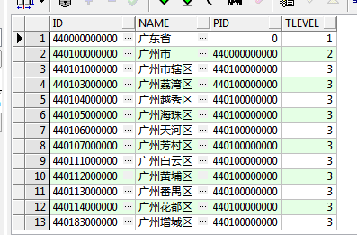

#### 基本操作


#### 分页查询

```sql
/* 
	tableName 为表名，rownum为行数
*/
select * from (select rownum rn,t.* from tableName t) where rn<=100 and rn >=10; 
```

#### order by

```sql
 /* Oracle 中的 select 查询出来的结果默认是不排序的，如果需要结果按照 插入顺序排序，可以用 rownum 关键字查询 */
select rownum rn, t.* from blog t order by rn desc
```

#### 树形查询

```sql
select t.code id, t.detail name, t.parentorgcode pid, level tlevel # level 是一个伪列
from t_org_region t start with t.code = 440000000000
#   					以哪个节点为根节点
connect by prior t.code = t.parentorgcode;
#			 这一行的code   下一行的parentorgcode
```

