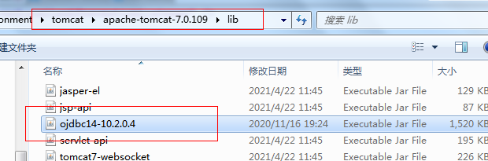

#### 1. 配置数据源

1. 导入需要连接诶的Jar包



2. 编辑 `server.xml`配置文件

> 在 `GlobalNamingResources`便签中加入数据源信息

```xml
<GlobalNamingResources>
    <!-- Editable user database that can also be used by
         UserDatabaseRealm to authenticate users
    -->
    <Resource name="UserDatabase" auth="Container"
              type="org.apache.catalina.UserDatabase"
              description="User database that can be updated and saved"
              factory="org.apache.catalina.users.MemoryUserDatabaseFactory"
              pathname="conf/tomcat-users.xml" />
    <!-- 添加的数据源信息-->
	<Resource name="jdbc/basic" 
			 type="javax.sql.DataSource" 
			 driverClassName="oracle.jdbc.driver.OracleDriver" 
			 url="url"   
			 maxActive="15" maxIdle="5" maxWait="5000"
			 validationQuery ="select 1 from dual" 
			 username="username" 
			 password="password"/> 	
  </GlobalNamingResources>
```

3. 编辑`content.xml`文件

>在`Context`便签中加入数据源信息

```xml
<Context>
    <WatchedResource>WEB-INF/web.xml</WatchedResource>
    
    <!-- 加入的数据源信息-->
	<ResourceLink global="jdbc/basic" name="jdbc/basic" type="javax.sql.DataSource"/>
</Context>
```

4. 在web项目中引用数据源

> `web.xml`中加入数据源 `web-app`便签内加入数据源

```xml
	<resource-ref>
		<description>JNDI DataSource</description>
		<res-ref-name>jdbc/basic</res-ref-name>
		<res-type>javax.sql.DataSource</res-type>
		<res-auth>Container</res-auth>
	</resource-ref>
</web-app>
```

#### 2. 配置多端口

> 编辑`server.xml`配置文件，将`Service`便签复制多几分
>
> Service便签中的name属性和 Engin 便签中的name属性需要修改

```xml
<!-- Service便签副本--> 
<Service name="Catalina1"> <!-- 名字需要修改-->
    <Connector port="80" protocol="HTTP/1.1"
               connectionTimeout="20000"
               redirectPort="8443" />
    <Engine name="Catalina1" defaultHost="localhost"> <!-- 名字需要修改-->
      <Realm className="org.apache.catalina.realm.LockOutRealm">
        <!-- This Realm uses the UserDatabase configured in the global JNDI
             resources under the key "UserDatabase".  Any edits
             that are performed against this UserDatabase are immediately
             available for use by the Realm.  -->
        <Realm className="org.apache.catalina.realm.UserDatabaseRealm"
               resourceName="UserDatabase"/>
      </Realm>

      <Host name="localhost"  appBase="webapps"
            unpackWARs="true" autoDeploy="true">
        <Valve className="org.apache.catalina.valves.AccessLogValve" directory="logs"
               prefix="localhost_access_log." suffix=".txt"
               pattern="%h %l %u %t &quot;%r&quot; %s %b" />
		<Context path = "/" docBase = "E:\work\enrionment\tomcat\apache-tomcat-7.0.109\webapps\freshTrain-midd" debug = "0" reloadable = "true"/>
      </Host>
    </Engine>
  </Service>
```

#### 3. 修改项目的虚拟路径

> 编辑`server.xml`文件，在`Host`便签内加入

```xml
<Host>
    <Context path = "/" docBase = "E:\work\enrionment\tomcat\apache-tomcat-7.0.109\webapps\freshTrain-midd" debug = "0" reloadable = "true"/>
</Host>
```

