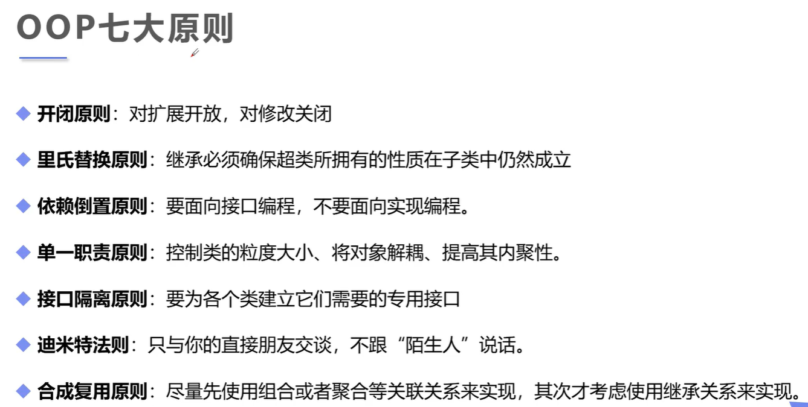
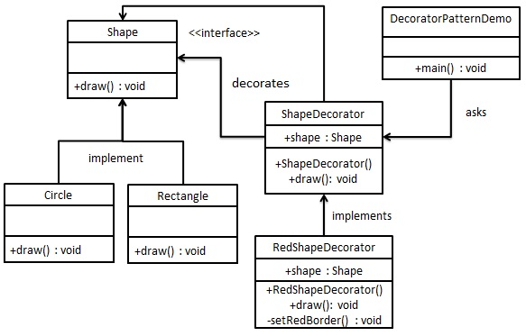

### OOP七大原则



### 单例模式

#### 概念

> 百度百科是这样定义的：单例模式是一种常用的软件设计模式。在它的核心结构中只包含一个被称为单例的特殊类。通过单例模式可以保证==系统中一个类只有一个实例==。

#### 单例模式分类

> A、懒汉单例模式：在第一次调用的时候实例化本身，在并发环境下，可能出现多个本身对象。所以线程是不安全的。
>
> B、饿汉单例模式：在类初始化时，已经自行实例化一个静态对象，所以本身就是线程安全的。
>
> C、登记单例模式：通过一个专门的类对各单例模式的单一实例进行管理和维护。

#### 特点

> A、 单例模式类只能有一个实例
> B、 单例模式类必须自己创建自己的唯一实例
> C、 单例模式类必须给所有其他对象提供这一实例

#### 实现

##### 懒汉式单例模式 

```java
// 线程不安全
public class SingLeto{
    /**
     * 该函数限制用户主动创建实例
     */
    // 所以构建方法必须私有化
    private SingLeto(){}
    
    //唯一实例，先置空
    private static SingLeto singLeto = null;
    
    /**
     * 获取SingLeto实例 (也称为静态工厂)
     */
    // 给 getSingLeto 加上 synchronized 可使现线程安全
    public static SingLeto getSingLeto(){
        // 当singLeto 为空时, 实例化singLeto
        if(singLeto == null){
            singLeto = new SingLeto();
        }
        return singLeto;
    }
}

// 双重检验模式
public class Singleton {

	/**
	 * 该函数限制用户主动创建实例
	 */
	private Singleton() {}
	// 添加了 volatile 字段
    如果不添加，那么实例化的那个线程可能先在cash中实例化，但未将结果刷入内存。导致判空有误
	private volatile static Singleton singleton = null;

	/**
	 * 获取Singleton实例，也叫静态工厂方法
	 * @return Singleton
	 */
	public static Singleton getInstance() {
		if (singleton == null) {
			synchronized (Singleton.class) {
				if (singleton == null) {
					singleton = new Singleton();
				}
			}
		}
		return singleton;
	}

}

/**
 * 描述：懒汉单例模式 ，静态内部类<p>
 * 作者： kimball <p>
 * E-mail: kimballlu@foxmail.com <p>
 * 日期：2016-11-16 下午4:30:32 <p>
 */
public class Singleton {

	/**
	 * 静态内部类
	 * @author kimball
	 *
	 */
	private static class LazyHolder {
		// 创建Singleton实例
       /**
       Java机制规定，内部类 LazyHolder只有在getInstance()方法第一次调用的时候才会被加载（实现了延迟加载效果），而且其加		载过程是线程安全的（实现线程安全）
       */
        // final 修饰 Singleto字段 保证Singleto的唯一性
		private static final Singleton INSTANCE = new Singleton();
	}

	/**
	 * 该函数限制用户主动创建实例
	 */
	private Singleton() {}

	/**
	 * 获取Singleton实例，也叫静态工厂方法
	 * @return Singleton
	 */
	public static final Singleton getInstance() {
		return LazyHolder.INSTANCE;
	}
}
```

##### 饿汉式单例模式

==和懒汉单例模式中的静态内部类格式很像==

```java
/**
 * 描述：饿汉单例模式<p>
 * 作者： kimball <p>
 * E-mail: kimballlu@foxmail.com <p>
 * 日期：2016-11-16 下午4:30:32 <p>
 */
public class Singleton {

	/**
	 * 该函数限制用户主动创建实例
	 */
	private Singleton() {}

	private static final Singleton singleton = new Singleton();

	/**
	 * 获取Singleton实例，也叫静态工厂方法
	 * @return Singleton
	 */
	public static Singleton getInstance() {
		return singleton;
	}

}
```

##### 登记单例模式

```java
/**
 * 描述：登记单例模式<p>
 * 作者： kimball <p>
 * E-mail: kimballlu@foxmail.com <p>
 * 日期：2016-11-16 下午4:30:32 <p>
 */
public class Singleton {

	// 存储需要进行维护和管理的类的实例
	private static Map<String, Singleton> map = new HashMap<String, Singleton>();
	
	/**
	 * 静态创建实例并添加到Map集合
	 */
	static {
		Singleton singleton = new Singleton();
		map.put(singleton.getClass().getName(), singleton);
	}

	/**
	 * 该函数限制用户主动创建实例
	 */
	private Singleton() {};

	/**
	 * 获取Singleton实例，也叫静态工厂方法
	 * @return Singleton
	 */
	public static Singleton getInstance(String name) {
		/* 根据指定的类的名称从mao中获取实例并返回 */
		return map.get(name);
	}

	// 一个示例性的商业方法
	public String about() {
		return "你好,我是RegSingleton";
	}

	public static void main(String[] args) {
		Singleton singleton = Singleton.getInstance("com.Singleton");
		System.out.println(singleton.about());
	}
}
```

##### 枚举单例模式

```java
public emm EnumSingle{
    INSTANCE;
    
    public EnumSingle getInstance(){
        return INSTANCE;
    }
}
```


### 工厂模式

#### 核心

> - 实例化对象不适用new，用工厂方法代替
> - 将选择实现类，创建对象同意管理和控制。从而将调用者跟我们的实现类解耦

#### 作用

> Factroy要解决的问题是：**希望能够创建一个对象，但创建过程比较复杂，希望对外隐藏这些细节。**
>
> 请特别留意“**创建过程比较复杂**“这个条件。如果不复杂，用构造函数就够了。比如你想用一个HashMap时也要搞一个factory，这就很中2了。

好，那什么是“复杂的创建过程呢“？举几个==例子：==

**例子1:** 创建对象可能是一个pool里的，不是每次都凭空创建一个新的。而pool的大小等参数可以用另外的逻辑去控制。比如连接池对象，线程池对象就是个很好的例子。

**例子2:** 对象代码的作者希望隐藏对象真实的的类型，而构造函数一定要真实的类名才能用。比如作者提供了

```java
abstract class Foo { 
 //...
}
```

而真实的实现类是

```java
public class FooImplV1 extends Foo {
  // ...
}
```

但他不希望你知道FooImplV1的存在（没准下次就改成V2了），只希望你知道Foo，所以他必须提供某种类似于这样的方式让你用：

```java
Foo foo = FooCreator.create();
// do something with foo ...
```

**例子3:** 对象创建时会有很多参数来决定如何创建出这个对象。比如你有一个数据写在文件里，可能是xml也可能是json。这个文件的数据可以变成一个对象，大概就可以搞成。

```java
Foo foo = FooCreator.fromFile("/path/to/the/data-file.ext");
```

再比如这个文件是描述一个可以显示在浏览器的UI的基础数据。而不同浏览器可以正确显示的需要的数据不太一样。这个“不一样”可以表达为：

```java
Foo foo = FooCreator.fromFile("/path/to/the/data-file.ext", BrowserType.CHROME);
```

这里第二个参数"BrowserType"是一个枚举，表示如何去生成指定要求的对象。所以这个fromFile内部可能是：

```java
public Foo fromFile(String path, BrowserType type) {
  byte[] bytes = Files.load(path);
  switch (type) {
     case CHROME: return new FooChromeImpl(bytes);
     case IE8: return new FooIE8V1Impl(bytes);
     // ...
  }
}    
```

当然，实际场景可能会复杂得多，会有大量的配置参数。

```java
Foo foo = FooCreator.fromFile("....", param1, param2, param3, ...);
```

如果需要，可以帮params弄成一个Config对象。而如果这个Config对象也很复杂，也许还得给Config弄个Factory。如果Factory本身的创建也挺复杂呢？嗯，弄个Factory的Factory。

**例子4：**简化一些常规的创建过程。上面可以看到根据配置去创建一个对象也很复杂。但可能95%的情况我们就创建某个特定类型的对象。这时可以弄个函数直接省略那些配置过程。纯粹就是为了方便。

```java
Foo foo = FooCreator.chromeFromFile("/path/to/the/date-file.ext");
```

现实当中，比如Java的线程池的相关创建api（如`Executors.newFixedThreadPool`等）就是这么干的。

**例子5:** 创建一个对象有复杂的依赖关系，比如Foo对象的创建依赖A，A又依赖B，B又依赖C……。于是创建过程是一组对象的的创建和注入。手写太麻烦了。所以要把创建过程本身做很好地维护。对，==Spring IoC就是这么干的。==

**例子6:** 你知道怎么创建一个对象，但是无法把控创建的时机。你需要把“如何创建”的代码塞给“负责什么时候创建”的代码。后者在适当的时机，就回调创建的函数。

在支持用函数传参的语言，比如js，go等，直接塞创建函数就行了。对于名词王国java，就得搞个XXXXFactory的类再去传。Spring IoC 也利用了这个机制，可以了解下`FactoryBean` 

**例子7:** 避免在构造函数中抛出异常。=="构造函数里不要抛出异常"==这条原则很多人都知道。不在这里展开讨论。但问题是，业务要求必须在这里抛一个异常怎么办？就像上面的`Foo`要求从文件读出来数据并创建对象。但如果文件不存在或者磁盘有问题读不出来都会抛异常。因此用`FooCreator.fromFile`这个工厂来搞定异常这件事。 

其实还有很多例子，就不继续扩展了。要点是，当你有任何复杂的的创建对象过程时，你都需要写一个某种createXXXX的函数帮你实现。再拓展一下范围，哪怕创建的不是对象，而是任何资源，也都得这么干。一句话：

**不管你用什么语言，创建什么资源。当你开始为“创建”本身写代码的时候，就是在使用“工厂模式”了。**

#### 实现

> 准备一个接口和一个实现类

```java
//接口
public interface Car {
    void name();
}

//实现类
public class Tesla implements Car{
    @Override
    public void name() {
        System.out.println("特斯拉");
    }
}
public class WuLing implements Car {
    @Override
    public void name() {
        System.out.println("五菱宏光");
    }
}
```

##### 简单工厂模式

```java
public class CarFactory {
    //方法一
    public static Car getCar(String name){
        switch (name){
            case "五菱":
                return new WuLing();
            case "特斯拉":
                return new Tesla();
            default:
                return null;
        }
    }
    //方法二
    public static Car getWuLing(){
        return new WuLing();
    }
    public static Car getTesLa(){
        return new TesLa();
    }
}
```

##### 工厂方法模式

```java
//准备一个工厂接口
public interface CarFactory {
    Car getCar();
}

//各自准备各自的工厂
public class TeslaFactory implements CarFactory{
    @Override
    public Car getCar() {
        return new Tesla();
    }
}

public class WuLingFactory implements CarFactory{
    @Override
    public Car getCar() {
        return new WuLing();
    }
}

//获得实例
public static void main(String[] args) {
        Car car = new TeslaFactory().getCar();
        Car car1 = new WuLingFactory().getCar();
}
```

### 装饰器模式

#### 概念

> 装饰器模式（Decorator Pattern）允许向一个现有的对象添加新的功能，同时又不改变其结构。这种类型的设计模式属于结构型模式，它是作为现有的类的一个包装。
>
> 这种模式创建了一个装饰类，用来包装原有的类，并在保持类方法签名完整性的前提下，提供了额外的功能。
>
> 通过下面的实例来演示装饰器模式的用法。其中，我们将把一个形状装饰上不同的颜色，同时又不改变形状类。

#### 介绍

> **意图：**动态地给一个对象添加一些额外的职责。就增加功能来说，装饰器模式相比生成子类更为灵活。
>
> **主要解决：**一般的，我们为了扩展一个类经常使用继承方式实现，由于继承为类引入静态特征，并且随着扩展功能的增多，子类会很膨胀。
>
> **何时使用：**在不想增加很多子类的情况下扩展类。
>
> **如何解决：**将具体功能职责划分，同时继承装饰者模式。
>
> **关键代码：** 1、Component 类充当抽象角色，不应该具体实现。 2、修饰类引用和继承 Component 类，具体扩展类重写父类方法。
>
> **应用实例：** 1、孙悟空有 72 变，当他变成"庙宇"后，他的根本还是一只猴子，但是他又有了庙宇的功能。 2、不论一幅画有没有画框都可以挂在墙上，但是通常都是有画框的，并且实际上是画框被挂在墙上。在挂在墙上之前，画可以被蒙上玻璃，装到框子里；这时画、玻璃和画框形成了一个物体。
>
> **优点：**装饰类和被装饰类可以独立发展，不会相互耦合，装饰模式是继承的一个替代模式，装饰模式可以动态扩展一个实现类的功能。
>
> **缺点：**多层装饰比较复杂。
>
> **使用场景：** 1、扩展一个类的功能。 2、动态增加功能，动态撤销。
>
> **注意事项：**可代替继承。

#### 实现

> 我们将创建一个 *Shape* 接口和实现了 *Shape* 接口的实体类。然后我们创建一个实现了 *Shape* 接口的抽象装饰类 *ShapeDecorator*，并把 *Shape*对象作为它的实例变量。
>
> *RedShapeDecorator* 是实现了 *ShapeDecorator* 的实体类。
>
> *DecoratorPatternDemo*，我们的演示类使用 *RedShapeDecorator* 来装饰 *Shape* 对象。



**代码**

- 准备一个Shape接口

```java
public interface Shape {
    void draw();
}
```

- 实现了Shape接口的实体类

```java
public class Circle implements Shape{
    @Override
    public void draw() {
        System.out.println("Shape:Circle");
    }
}
```

- 实现了Shape接口的装饰器ShapeDecorator

```java
//Shape的装饰器
public class ShapeDecorator implements Shape{
    // 保存接口的引用
    protected Shape shape;

    //构造方法
    public ShapeDecorator(Shape shape) {
        this.shape = shape;
    }

    @Override
    public void draw() {
        shape.draw();
    }
}
```

- 设计需要扩展功能的装饰器

```java
public class RedShapeDecorator extends ShapeDecorator{
    // 有参构造函数
    public RedShapeDecorator(Shape shape) {
        super(shape);
    }

    @Override
    public void draw() {
        //为了扩展draw的功能
        super.draw();
        //调色方法
        setRedBorder();
    }

    private void setRedBorder(){
        System.out.println("Border Color:Red");
    }
}
```

- 测试

```java
public class Main {
    public static void main(String[] args) {
        Shape circle = new Circle();
        circle.draw();
        System.out.println("==========================================");
        //扩展circle.draw()方法的功能
        RedShapeDecorator redCircle = new RedShapeDecorator(circle);
        redCircle.draw();
    }
}
```

### 代理模式

#### 概念

> 在代理模式（Proxy Pattern）中，一个类代表另一个类的功能。这种类型的设计模式属于结构型模式。
>
> 在代理模式中，我们创建具有现有对象的对象，以便向外界提供功能接口。

#### 介绍

> **意图：**为其他对象提供一种代理以控制对这个对象的访问。
>
> **主要解决：**在直接访问对象时带来的问题，比如说：要访问的对象在远程的机器上。在面向对象系统中，有些对象由于某些原因（比如对象创建开销很大，或者某些操作需要安全控制，或者需要进程外的访问），直接访问会给使用者或者系统结构带来很多麻烦，我们可以在访问此对象时加上一个对此对象的访问层。
>
> **何时使用：**想在访问一个类时做一些控制。
>
> **如何解决：**增加中间层。
>
> **关键代码：**实现与被代理类组合。
>
> **应用实例：** 1、Windows 里面的快捷方式。 2、猪八戒去找高翠兰结果是孙悟空变的，可以这样理解：把高翠兰的外貌抽象出来，高翠兰本人和孙悟空都实现了这个接口，猪八戒访问高翠兰的时候看不出来这个是孙悟空，所以说孙悟空是高翠兰代理类。 3、买火车票不一定在火车站买，也可以去代售点。 4、一张支票或银行存单是账户中资金的代理。支票在市场交易中用来代替现金，并提供对签发人账号上资金的控制。 5、spring aop。
>
> **优点：** 1、职责清晰。 2、高扩展性。 3、智能化。
>
> **缺点：** 1、由于在客户端和真实主题之间增加了代理对象，因此有些类型的代理模式可能会造成请求的处理速度变慢。 2、实现代理模式需要额外的工作，有些代理模式的实现非常复杂。
>
> **使用场景：**按职责来划分，通常有以下使用场景： 1、远程代理。 2、虚拟代理。 3、Copy-on-Write 代理。 4、保护（Protect or Access）代理。 5、Cache代理。 6、防火墙（Firewall）代理。 7、同步化（Synchronization）代理。 8、智能引用（Smart Reference）代理。
>
> **注意事项：** 1、和适配器模式的区别：适配器模式主要改变所考虑对象的接口，而代理模式不能改变所代理类的接口。 2、和装饰器模式的区别：装饰器模式为了增强功能，而代理模式是为了加以控制。

#### 静态代理

- 角色分析：一般会使用接口或者抽象类来解决
- 真实角色：被代理的角色
- 代理角色：代理真实角色，代理真实角色后，我们一般会做一些附属操作
- 客户：访问代理角色

123